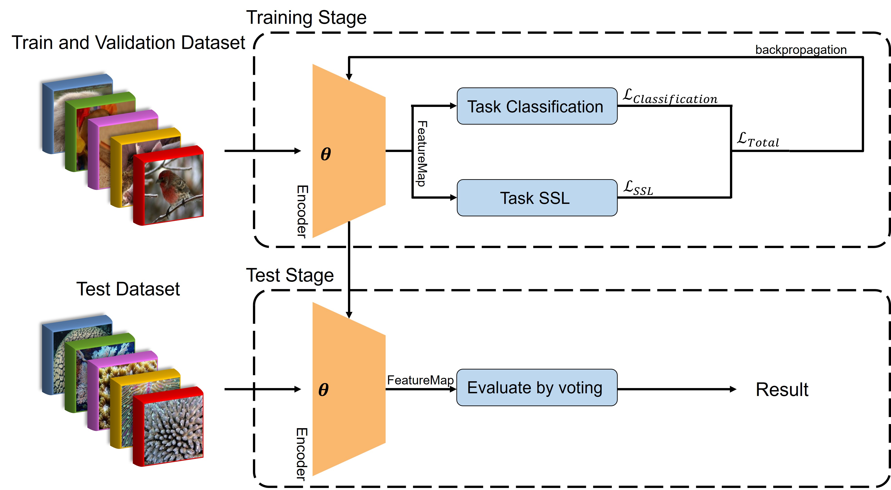

# OCEAN
A Self-Supervised Hybrid Similarity Framework for Underwater Coral Species Classification

This repository contains the official code for OCEAN, a self-supervised learning algorithm optimized for coral assessment for few-shot image classification. 
OCEAN is designed for few-shot coral classification environments.


## Approach
Our method uses self-supervised learning during training to enhance the model's ability to relate global and local information via a contrastive learning pretext task. 
Additionally, the evaluation phase of OCEAN now better leverages local image features, enabling it to fully exploit the repetitive structures typical of corals.



OCEAN effectively combines few-shot learning, self-supervised learning, and dual-metric loss functions to achieve superior performance in coral classification tasks.

## Compare with Othor Models
This study focuses on the few-shot classification problem of underwater corals using the proposed OCEAN model. Therefore, we compare the performance of OCEAN with other few-shot learning models. 

| Year | Model                    | 1-Shot    | 5-Shot    | 10-Shot   |
|------|--------------------------|-----------|-----------|-----------|
| 2015 | SiameseNet          | 32.00 %   | 35.05 %   | 37.23 %   |
| 2017 | ProtoNets             | 46.00 %   | 62.13 %   | 66.63 %   |
| 2018 | RelationNetwork      | 40.49 %   | 55.33 %   | 59.83 %   |
| 2020 | BSNet| 39.98 %   | 52.70 %   | 56.68 %   |
| 2020 | FEAT (Transformer)   | 37.81 %   | 52.55 %   | 57.10 %   |
| 2023 | ESPT(SSL)            | 48.84 %   | 67.51 %   | 71.54 %   |
| 2024 | OCEAN (Ours)              | 50.71 %   | 71.83 %   | 76.52 %   |


## Code Environment
Our code is run on Ubuntu 24.04 with cuda 12.2 and Pytorch 1.13. GPU is RTX 4070 12GB.

You can create a same conda environment as ours using the following command line:
```
cd OCEAN
conda env create -f environment.yml
conda activate ocean
```

## Downloading The Datasets and Checkpoints
#### tieredImageNet
Before training the OCEAN model, requires downloading the data set.
The [tieredImageNet](https://paperswithcode.com/dataset/tieredimagenet) dataset is a larger subset of ILSVRC-12 with 608 classes. You can visit their official website [IMAGENET](https://www.image-net.org/index.php) for more information.

#### Coral Dataset of This Study.
For the final testing stage, the test dataset is a coral dataset compiled for this study. This coral dataset contains 10 types of corals, with a total of 1,224 coral samples. [Download Link](https://drive.google.com/file/d/19m0PyqhWPLPRX6YX1d38CkJbwKemqGMQ/view?usp=sharing)


#### checkpoints download
If you need to test OCEAN model. We have provided 
link for Google Drive.
[Download Checkpoints](https://drive.google.com/file/d/1Q2547d6ZxUBgSd-AJYt5j9z6HHZwi0_Y/view?usp=sharing)

**After unzipping a download file, move it to the location directory.** 

like /checkpoints, /datasets/tieredImagenet and /datasets/fewshot_coralset

## Setting tieredImagenet Dataset
If you have downloaded the tieredImagenet Dataset, please proceed by executing the following command.
```
./datasets/setting_tieredImagenet.sh
```

## Train OCEAN Model
We have prepared a trainer for you to train OCEAN; you just using the following command line.
```
python train_model.py
```
If you need to adjust parameters, you can do so in train_model.py."


## TEST OCEAN Model
Both the checkpoint you downloaded and the OCEAN model you trained can be used by uncommenting the relevant sections in test_model.py according to your needs. Use the following command to run the tests.
```
python test_model.py
```
