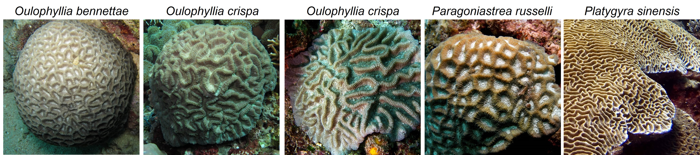

# OCEAN
# A Self-Supervised Hybrid Similarity Framework for Underwater Coral Species Classification

### Key Features

- **Hybrid Similarity Metric**  
  Combines *Euclidean distance* and *cosine similarity* to capture both feature magnitude and direction.

- **High Accuracy**  
  Achieves **71.8%** accuracy on **5-way 5-shot** and **76.52%** on **5-way 10-shot**, outperforming models like ProtoNet, FEAT, and ESPT by up to **10%**.

- **Self-Supervised Learning (SSL)**  
  Integrates contrastive learning to learn robust representations from unlabeled coral images.

- **Local Feature Aggregation**  
  Exploits repetitive coral structures to improve spatial understanding and classification accuracy.

- **Strong Class-Specific Performance**  
  Especially effective on:
  - *Siderastreidae*: **87.52%**
  - *Fungiidae*: **88.95%**


## Approach
Our method uses self-supervised learning during training to enhance the model's ability to relate global and local information via a contrastive learning pretext task. 
Additionally, the evaluation phase of OCEAN now better leverages local image features, enabling it to fully exploit the repetitive structures typical of corals.


## Code Environment
Our code is run on Ubuntu 24.04 with cuda 12.2 and Pytorch 1.13. GPU is RTX 4070 12GB.


You can create a same conda environment as ours using the following command line:
```
conda env create -f environment.yml
conda activate ocean
```


## Downloading The Datasets and Checkpoints
#### tieredImageNet
Before training the OCEAN model, requires downloading the data set.
The [tieredImageNet](https://paperswithcode.com/dataset/tieredimagenet) dataset is a larger subset of ILSVRC-12 with 608 classes. You can visit their official website [IMAGENET](https://www.image-net.org/index.php) for more information.


#### Coral Dataset of This Study.
For the final testing stage, the test dataset is a coral dataset compiled for this study. This coral dataset contains 10 types of corals, with a total of 1,224 coral samples. [Download Link](https://drive.google.com/file/d/19m0PyqhWPLPRX6YX1d38CkJbwKemqGMQ/view?usp=sharing)



#### checkpoints download
If you need to test OCEAN model. We have provided 
link for Google Drive.
[Download Checkpoints](https://drive.google.com/file/d/1Q2547d6ZxUBgSd-AJYt5j9z6HHZwi0_Y/view?usp=sharing)

**After unzipping a download file, move it to the location directory.** 

like /checkpoints, /datasets/tieredImagenet and /datasets/fewshot_coralset

## Setting tieredImagenet Dataset
If you have downloaded the tieredImagenet Dataset, please proceed by executing the following command.
```
./datasets/setting_tieredImagenet.sh
```

## Train OCEAN Model
We have prepared a trainer for you to train OCEAN; you just using the following command line.
```
python train_model.py
```


## TEST OCEAN Model
Both the checkpoint you downloaded and the OCEAN model you trained can be used by uncommenting the relevant sections in test_model.py according to your needs. Use the following command to run the tests.
```
python test_model.py
```

## Citation
Yu-Shiuan Tsai, Zhen-Rong Wu, Jian-Zhi Liu (2025). A Self-Supervised Hybrid Similarity Framework for Underwater Coral Species Classification. CMC-Computers Materials & Continua.
https://doi.org/10.32604/cmc.2025.066509.
